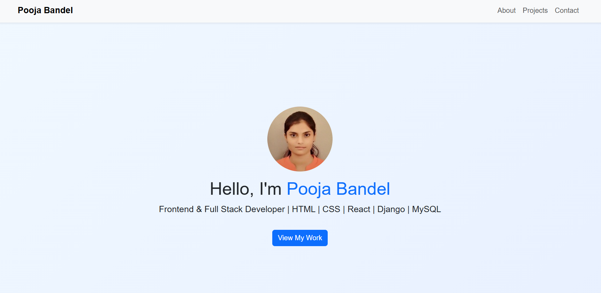
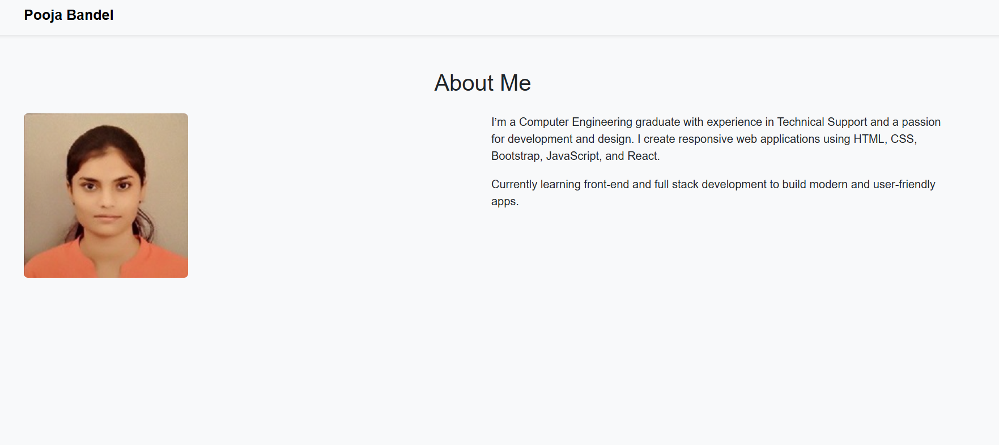
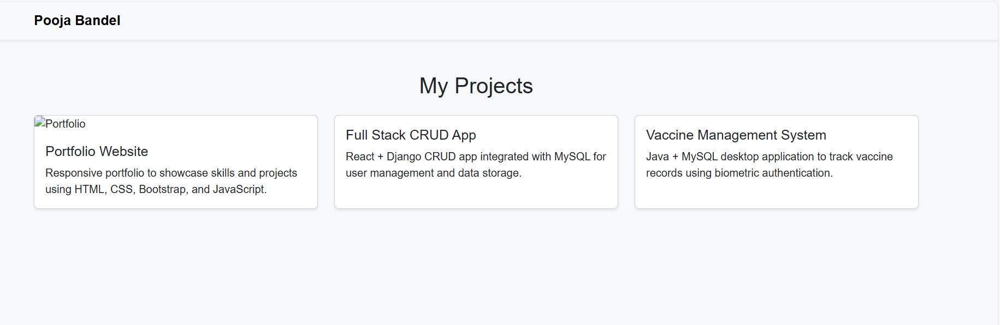
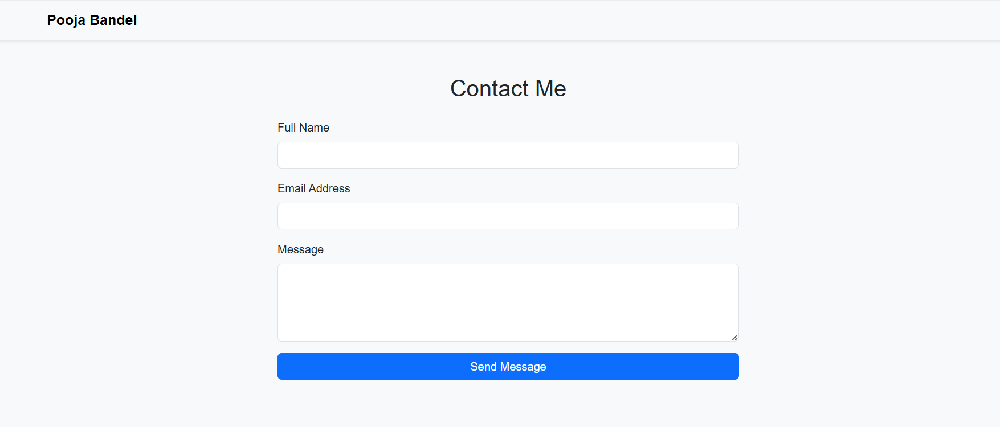

# 💼 Personal Portfolio Website

A fully responsive **Portfolio Website** built using **HTML, CSS, Bootstrap 5, and JavaScript** to showcase my professional profile, skills, and projects.

---

## 🚀 Live Demo  
🔗 **Portfolio Website:** <https://poojabandel9.github.io/portfolio-website/>

---

## 🧠 About the Project

This portfolio website highlights my skills, experience, and personal projects in a clean and modern interface.  
It includes a navigation bar, about section, projects gallery, and contact form for recruiters or collaborators to reach out.

---

## 🛠️ Tech Stack

- **HTML5** – Structure and content  
- **CSS3** – Styling and responsiveness  
- **Bootstrap 5** – Layout and components  
- **JavaScript (Vanilla)** – Interactivity  

---

## 📁 Folder Structure

   portfolio-website/
   │
   ├── index.html
   ├── about.html
   ├── projects.html
   ├── contact.html
   │
   ├── css/
   │ └── style.css
   │
   ├── js/
   │ └── main.js
   │
   └── images/
   ├── profile.jpg
   ├── home.png
   ├── about.png
   ├── projects.png
   └── contact.png


---

## 📸 Screenshots

### 🏠 Home Page  


### 👩‍💻 About Page  


### 💼 Projects Page  


### 📬 Contact Page  


---

## 🧰 Features

- Fully responsive design (mobile-first)  
- Smooth navigation using Bootstrap  
- Clean layout to highlight projects & skills  
- Simple, fast-loading static website  

---

## ⚙️ How to Run Locally

1. Clone the repository  
   ```bash
   git clone https://github.com/poojabandel9/portfolio-website.git

2. Open the project folder

   cd portfolio-website

3. Open index.html in your browser

   Double-click it OR Right-click → Open With Browser

##  🤝 Connect with Me

**LinkedIn:** (https://www.linkedin.com/in/pooja-bandel-983060202/)

**GitHub:** https://github.com/poojabandel9

**Email:**  (mailto:poojabandel9@gmail.com)
